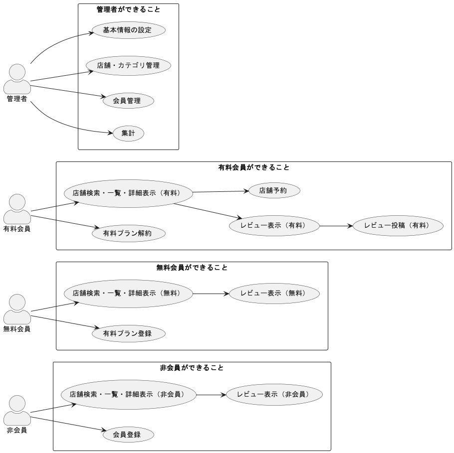
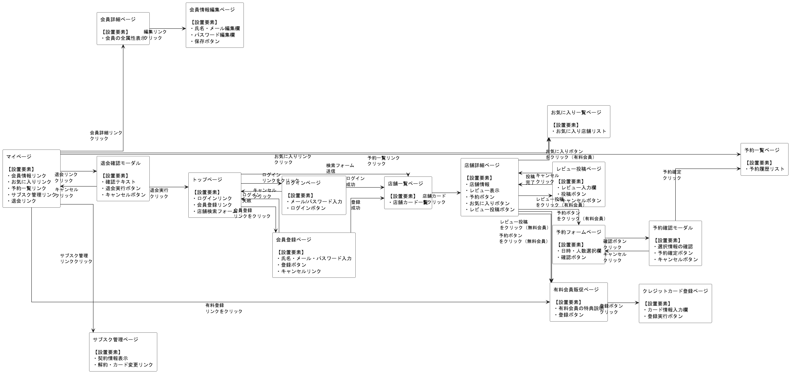
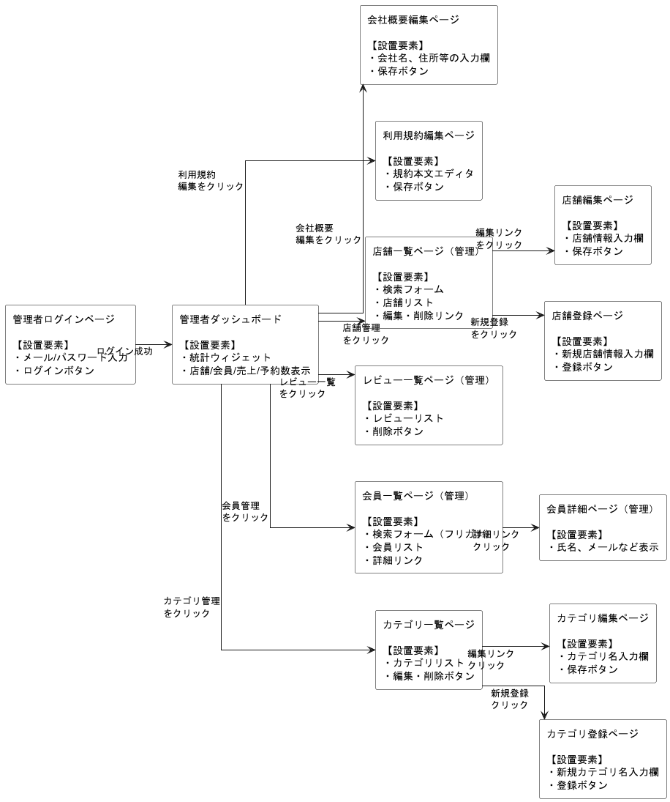

# NAGOYAMESHI 要件定義書

## 1. 要求定義（概要・背景・目的）

### これから開発するWebアプリ
食べログ風の飲食店予約サイト NAGOYAMESHI
### 案件の背景（要求定義）
他県や海外から名古屋市に訪れるインバウンド顧客が年々増加している。
その大きな理由の1つは、名古屋市のB級グルメの人気の高さである。
しかし現状では、名古屋市のB級グルメのみをまとめたレビューサイトが存在しない。
そこで、名古屋市のB級グルメのレビューのみをまとめたWebサイトを開設しようと思い至った。
### 前提情報
・アプリ上で店舗の予約ができるが、会計はできない
・月額300円の有料会員は全機能使えるが、無料会員は一部機能しか使えない
・有料会員になれば、予約やレビューの投稿、お気に入りの追加ができるようになる
・有料会員はクレジットカードで支払いを行う
・管理者はサービスの基本情報設定、店舗情報の登録、会員管理、サブスクの売上管理ができる
### 用語の定義
| 用語                     | 説明                       |
| ------------------------ | ------------------------------- |
|非会員                     | NAGOYAMESHIに登録していないユーザー |
|会員                   | NAGOYAMESHIに登録しているユーザー |
|無料会員                   | 会員の中でも利用できる機能が制限されているユーザー |
|有料会員                   | 会員の中でもサブスクリプション契約を結び、機能を無制限に利用できるユーザー |
|管理者                   | NAGOYAMESHIを管理するユーザー |
|店舗                   | NAGOYAMESHIに掲載されている飲食店 |
|レビュー                   | 店舗に対するテキスト形式の感想および星の数による評価（最大5つ） |
|カテゴリ                   | 和食、洋食、魚介・海鮮料理、パスタなど、その店舗が扱っている料理の種類 |
|予約                   | 店舗に対し、指定した日時・人数で来店することをあらかじめ約束しておくこと |
|お気に入り                   | 気に入った店舗をあとからまとめて確認できるようにすること |
|決済                   | ASPを利用し、クレジットカードでサブスクリプション課金を行うこと |

### 会員側ができること
・会員登録、ログインする
・店舗を検索、閲覧する
・予約する
・レビューする

### 管理者側ができること
**基本情報の設定**
・会社概要の編集
・利用規約の編集

**店舗・カテゴリ管理**
・店舗情報の一覧表示/検索
・店舗情報の登録/編集/削除
・カテゴリの一覧表示/検索
・カテゴリの登録/編集/削除
・レビューの一覧表示
・レビューの削除

**会員管理**
・会員情報の一覧表示/検索

**集計**
・総会員数
・無料会員数
・有料会員数
・店舗数
・総予約数
・月間売上

### ユースケース図

PlantUMLで記述されたファイル：[usecase.puml](uml/usecase.puml)

---

## 2. 実装機能（要件定義）

以下は会員向けに提供する主要機能とその説明です。

| 機能                     | 説明                       |
| ---------------------- | ------------------------ |
| **店舗情報**               |                          |
| 店舗名による店舗の検索機能          | 指定されたキーワードに一致する店舗名の検索機能。 |
| カテゴリ、予算による店舗の絞り込み機能    | ユーザーの希望条件に応じたフィルタリングを実施。 |
| 評価、登録日による並べ替え機能        | 店舗のレビュー評価や登録日によるソート機能。   |
| 店舗詳細ページにおけるレビューの表示機能   | 店舗ごとのユーザーレビューを閲覧できる機能。   |
| **会員登録**               |                          |
| メール認証機能                | 登録時にメール認証を行い、本人確認を実施。    |
| メールアドレスとパスワードによるログイン機能 | 一般的な認証機構によるログインを提供。      |
| **会員情報**               |                          |
| 会員情報の編集機能              | ユーザーが自身の情報（氏名・住所等）を更新可能。 |
| 有料会員へのアップグレード機能        | 通常会員から有料会員へ切り替えが可能。      |
| **有料会員**               |                          |
| サブスク契約機能               | 定額制の有料プランに加入する機能。        |
| サブスク契約の解除機能            | 有料プランの解約手続きを行う機能。        |
| クレジットカード情報の編集機能        | 決済情報を更新する機能（例：カード番号の変更）。 |
| お気に入りの追加機能             | 気になる店舗をお気に入りリストに登録。      |
| お気に入り店舗の一覧表示機能         | 登録済みのお気に入り店舗を一覧で表示。      |
| 店舗詳細ページにおけるレビューの投稿機能   | 各店舗にレビューを投稿する機能。         |
| 店舗の予約機能                | 利用したい店舗の来店予約を行う機能。       |
| 予約のキャンセル機能             | 予約済みの内容をキャンセルする機能。       |

以下は管理者向けに提供する主要機能とその説明です。

| 機能                     | 説明                             |
| ---------------------- | ------------------------------ |
| **認証機能**               |                                |
| メールアドレスとパスワードによるログイン機能 | 管理者専用のログイン認証機能を提供。             |
| **基本情報の設定**            |                                |
| 会社概要の編集機能              | 会社情報（住所、代表者、連絡先など）を管理画面から編集可能。 |
| 利用規約の編集機能              | サイトの利用規約を管理画面上で編集可能。           |
| **店舗管理**               |                                |
| 店舗の一覧表示機能              | 登録済みの全店舗をリスト表示。                |
| 店舗名による店舗の検索機能          | 店舗名をキーワードにした検索機能。              |
| 店舗の登録・編集・削除機能          | 店舗情報の追加・更新・削除を行う。              |
| レビューの一覧表示機能            | 各店舗のレビューを管理者側で一括表示。            |
| レビューの削除機能              | 不適切なレビューの削除機能。                 |
| **会員管理**               |                                |
| 会員の一覧表示機能              | 全会員の情報を一覧で表示。                  |
| フリガナによる会員の検索機能         | 会員のフリガナに基づいた検索を可能にする。          |
| **カテゴリ管理**             |                                |
| カテゴリの一覧表示機能            | 登録済みカテゴリの一覧表示。                 |
| カテゴリ名によるカテゴリの検索機能      | カテゴリ名を指定して絞り込む検索機能。            |
| カテゴリの登録・編集・削除機能        | カテゴリの追加、編集、削除操作を提供。            |
| **集計機能**               |                                |
| 総会員数                   | 現在の全会員数を集計・表示。                 |
| 無料会員数                  | 無料プラン利用者数の集計。                  |
| 有料会員数                  | 有料プラン利用者数の集計。                  |
| 店舗数                    | 登録されている店舗の総数を表示。               |
| 総予約数                   | サイト全体での予約件数の集計。                |
| 月間売上                   | 当月の売上金額を表示。                    |

---

## 3. 機能設計
### 会員側 機能設計一覧
| No | 大分類  | 小分類                | 説明                                                             | 必須 | 任意 |
| -- | ---- | ------------------ | -------------------------------------------------------------- | -- | -- |
| 1  | 店舗情報 | トップページ             | 検索ボックスやカテゴリボタン、評価が高い店舗、新規掲載店舗など、会員が目的の店舗を見つけやすくなるような機能を集約する。   | ◯  |    |
| 2  | 店舗情報 | 店舗名・住所・カテゴリによる検索機能 | 検索ボックスに店舗名・住所・カテゴリを入力することで、それらのキーワードを含む店舗を検索できるようにする。          | ◯  |    |
| 3  | 店舗情報 | カテゴリによる絞り込み機能      | カテゴリのボタンをクリックすることで、そのカテゴリが設定された店舗の一覧を表示できるようにする。               | ◯  |    |
| 4  | 店舗情報 | 予算による絞り込み機能        | セレクトボックスから予算を選択することで、最低価格がその予算以下の店舗の一覧を表示できるようにする。             | ◯  |    |
| 5  | 店舗情報 | 評価による並べ替え機能        | 評価が高い順に店舗を並べ替えられるようにする。                                        | ◯  |    |
| 6  | 店舗情報 | 登録日による並べ替え機能       | 登録日が新しい順に店舗を並べ替えられるようにする。                                      | ◯  |    |
| 7  | 店舗情報 | 店舗一覧ページ            | 検索や絞り込みに応じた結果を表示する。                                            | ◯  |    |
| 8  | 店舗情報 | 店舗詳細ページ            | 店舗画像や説明、店舗の基本情報などを表示する。                                        | ◯  |    |
| 9  | 店舗情報 | レビューの表示機能          | 店舗詳細ページにおいて、テキストによるレビューや星の数による評価を表示する。                         | ◯  |    |
| 10 | 会員登録 | メール認証機能            | 会員登録時に入力されたメールアドレス宛てにメールを送信し、認証を行う。                            | ◯  |    |
| 11 | 会員登録 | ログイン機能             | 登録したメールアドレスとパスワードを使ってアプリにログインできるようにする。                         | ◯  |    |
| 12 | 会員情報 | 会員情報の編集機能          | 会員登録時に設定した氏名、フリガナ、メールアドレスなどを編集できるようにする。メールアドレスを変更した場合は再度認証を行う。 | ◯  |    |
| 13 | 会員情報 | 有料会員へのアップグレード機能    | 有料会員限定機能にアクセスした際にアップグレードを促し、クレジットカード情報を登録して有料会員へ切り替える機能。       | ◯  |    |
| 14 | 有料会員 | サブスクリプション契約機能      | 外部サービスを利用して月額300円のサブスクリプション契約を結べるようにする。                        | ◯  |    |
| 15 | 有料会員 | サブスクリプション契約の解除機能   | サブスクリプション契約を解除できるようにする。                                        | ◯  |    |
| 16 | 有料会員 | クレジットカード情報の編集機能    | サブスクリプション契約の決済に利用するクレジットカード情報を編集できるようにする。                      | ◯  |    |
| 17 | 有料会員 | お気に入りの追加機能         | 店舗詳細ページにおいて、その店舗をお気に入りに追加できるようにする。                             | ◯  |    |
| 18 | 有料会員 | お気に入り店舗の一覧表示機能     | マイページにおいて、お気に入りに追加した店舗の一覧を表示できるようにする。                          | ◯  |    |
| 19 | 有料会員 | レビューの投稿・編集機能       | 店舗詳細ページにおいて、その店舗のレビューや評価を投稿・編集できるようにする。                        | ◯  |    |
| 20 | 有料会員 | 店舗の予約機能            | 店舗詳細ページにおいて、カレンダーを使って予約できるようにする。                               | ◯  |    |
| 21 | 有料会員 | 予約のキャンセル機能         | 予約日時を過ぎていなければ、予約をキャンセルできるようにする。                                | ◯  |    |

### 管理者側 機能設計一覧
| No | 大分類     | 小分類             | 説明                                          | 必須 | 任意 |
| -- | ------- | --------------- | ------------------------------------------- | -- | -- |
| 1  | 認証機能    | ログイン機能          | メールアドレスとパスワードによるログイン機能。                     | ◯  |    |
| 2  | 基本情報の設定 | 会社概要の編集機能       | 会員に対して表示する会社概要の内容を編集できるようにする。               | ◯  |    |
| 3  | 基本情報の設定 | 利用規約の編集機能       | 会員登録時に表示する利用規約の内容を編集できるようにする。               | ◯  |    |
| 4  | 店舗管理    | 店舗名による検索機能      | 検索ボックスに店舗名を入力することで、その店舗名を含む店舗を検索できるようにする。   | ◯  |    |
| 5  | 店舗管理    | 店舗一覧ページ         | 登録されている店舗の一覧を表示する。検索した場合はその結果を表示する。         | ◯  |    |
| 6  | 店舗管理    | 店舗詳細ページ         | 店舗の全情報を表示する。                                | ◯  |    |
| 7  | 店舗管理    | 店舗の登録・編集・削除機能   | 店舗を登録・編集・削除できるようにする。                        | ◯  |    |
| 8  | 店舗管理    | レビュー一覧ページ       | 店舗詳細ページから、その店舗のレビュー一覧ページにアクセスできるようにする。      | ◯  |    |
| 9  | 店舗管理    | レビューの削除機能       | レビュー一覧ページにおいて、不適切なレビューを削除できるようにする。          | ◯  |    |
| 10 | 会員管理    | フリガナによる検索機能     | 検索ボックスにフリガナを入力することで、そのフリガナを含む会員を検索できるようにする。 | ◯  |    |
| 11 | 会員管理    | 会員一覧ページ         | 登録されている会員の一覧を表示する。検索した場合はその結果を表示する。         | ◯  |    |
| 12 | 会員管理    | 会員詳細ページ         | 会員のパスワード以外の全情報を表示する。                        | ◯  |    |

管理画面では上記2ページを実装済み。検索キーワードとページ番号を指定して閲覧できる。
| 13 | カテゴリ管理  | カテゴリ一覧ページ       | 登録されているカテゴリの一覧を表示する。                        | ◯  |    |
| 14 | カテゴリ管理  | カテゴリの登録・編集・削除機能 | カテゴリを登録・編集・削除できるようにする。                      | ◯  |    |
| 15 | 集計機能    | 総会員数            | アプリの総会員数を管理画面のトップページに表示する。                  | ◯  |    |
| 16 | 集計機能    | 無料会員数           | アプリの無料会員数を管理画面のトップページに表示する。                 | ◯  |    |
| 17 | 集計機能    | 有料会員数           | アプリの有料会員数を管理画面のトップページに表示する。                 | ◯  |    |
| 18 | 集計機能    | 店舗数             | アプリの店舗数を管理画面のトップページに表示する。                   | ◯  |    |
| 19 | 集計機能    | 総予約数            | これまでの総予約数を管理画面のトップページに表示する。                 | ◯  |    |
| 20 | 集計機能    | 月間売上            | アプリの今月の月間売上を管理画面のトップページに表示する。               | ◯  |    |

---

## 4. 非機能要件

サービス提供にあたって満たすべき非機能要件は以下の通りです。

| 非機能要求  | 説明                    | 要求例                                  | 要件                                                      |
| ---------- | ----------------------- | -------------------------------------- | ------------------------------------------------------- |
| 可用性    | サービスを継続的に利用可能とする要求    | - 運用スケジュール - 障害対応                 | - Webサーバーが冗長化されていること                                    |
| 性能・拡張性 | サービスの性能及び、将来の拡張に関する要求 | - トランザクション数 - 利用ユーザー数 - システム負荷 | - 店舗の検索機能や絞り込み機能がスムーズに動作すること      |
| 運用・保守性 | サービスの運用と保守に関する要求      | - 本番環境とステージング環境     | - トラブル発生時のマニュアルが整備されていること                               |
| 移行制    | 現行システムの移行に関する要求       | - バックアップ - データ移行CSV   | - 本番と同じような環境で移行テストを行うこと                                 |
| セキュリティ | サービスの安全を担保するための要求 | - 利用制限 - 不正アクセス防止    | - CSRF対策が行われていること - ページごとに認証が行われていること（無料会員・有料会員・管理者） |

## 5. 画面遷移図
**ユーザー向け画面遷移図**
PlantUMLで記述されたファイル：[screenflow.puml](uml/screenflow.puml)

**管理者向け画面遷移図**
PlantUMLで記述されたファイル：[screenflow.puml](uml/admin_screenflow.puml)

## 6. ER図（エンティティ・リレーションシップ図）
本システムにおける主要なデータ構造は以下の通りです。
ユーザー、店舗、レビュー、予約、お気に入り、管理用情報などで構成されています。

**テーブル一覧と役割（概要）**
| テーブル名                 | 目的・役割               |
| --------------------- | ------------------- |
| `users`               | ユーザー情報（無料／有料／管理者など） |
| `roles`               | ユーザーの権限管理（一般・管理者など） |
| `verification_tokens` | 認証用トークン管理（メール確認など）  |
| `restaurants`         | 掲載される店舗情報           |
| `categories`          | 店舗のカテゴリ情報（和食・洋食など）  |
| `category_restaurant` | 店舗とカテゴリの中間テーブル（多対多） |
| `reviews`             | ユーザーのレビュー投稿         |
| `reservations`        | ユーザーによる店舗予約情報       |
| `favorites`           | お気に入り店舗管理           |
| `companies`           | 運営会社の基本情報           |

ER図イメージ（dbdiagram DSL 準拠）
ER図は dbdiagram.io で管理・編集可能です。
最新のソースは以下のDSLで記述されています。

 
ER図定義（クリックで展開）

Table roles {
  id int [pk, increment]
  name varchar
}

Table users {
  id int [pk, increment]
  name varchar
  furigana varchar
  postal_code varchar
  address varchar
  phone_number varchar
  birthday date
  occupation varchar
  email varchar
  password varchar
  role_id int [ref: > roles.id]
  enabled boolean
  stripe_customer_id varchar
  created_at datetime
  updated_at datetime
}

Table verification_tokens {
  id int [pk, increment]
  user_id int [ref: > users.id]
  created_at datetime
  updated_at datetime
}

Table categories {
  id int [pk, increment]
  name varchar
}

Table restaurants {
  id int [pk, increment]
  name varchar
  image varchar
  description text
  lowest_price int
  highest_price int
  postal_code varchar
  address varchar
  opening_time time
  closing_time time
  seating_capacity int
  created_at datetime
  updated_at datetime
}

Table category_restaurant {
  id int [pk, increment]
  restaurant_id int [ref: > restaurants.id]
  category_id int [ref: > categories.id]
  created_at datetime
  updated_at datetime
}

Table reviews {
  id int [pk, increment]
  content text
  score int
  restaurant_id int [ref: > restaurants.id]
  user_id int [ref: > users.id]
  created_at datetime
  updated_at datetime
}

Table reservations {
  id int [pk, increment]
  reserved_datetime datetime
  number_of_people int
  restaurant_id int [ref: > restaurants.id]
  user_id int [ref: > users.id]
  created_at datetime
  updated_at datetime
}

Table favorites {
  id int [pk, increment]
  restaurant_id int [ref: > restaurants.id]
  user_id int [ref: > users.id]
  created_at datetime
  updated_at datetime
}

Table companies {
  id int [pk, increment]
  name varchar
  postal_code varchar
  address varchar
  representative varchar
  capital varchar
  business varchar
  number_of_employees varchar
  created_at datetime
  updated_at datetime
}

